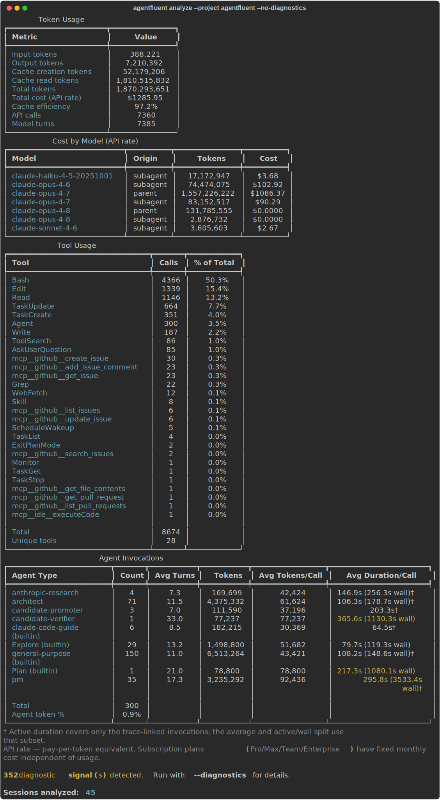
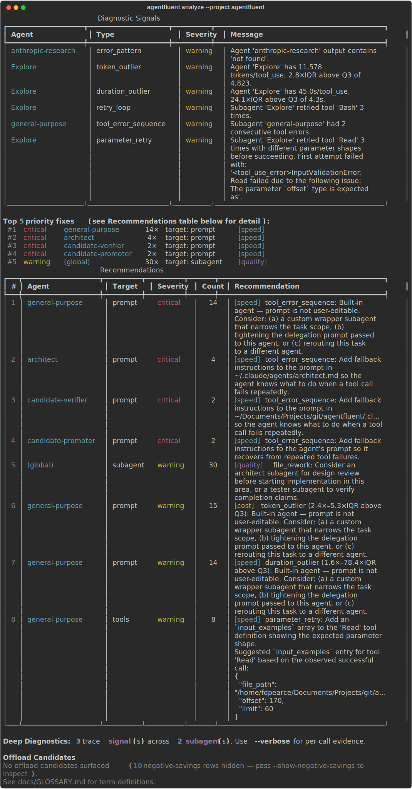
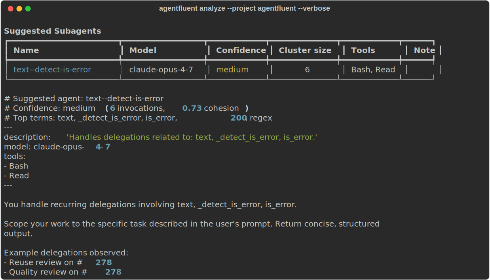
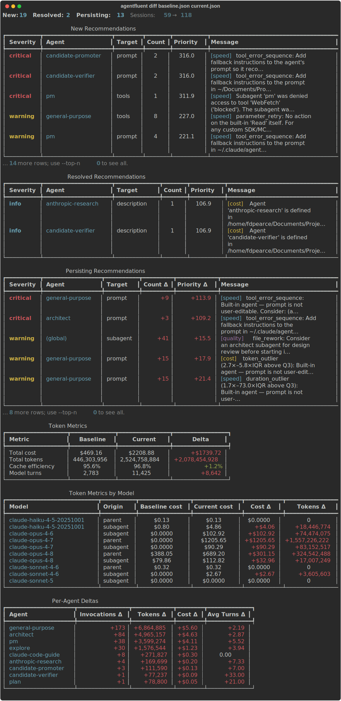
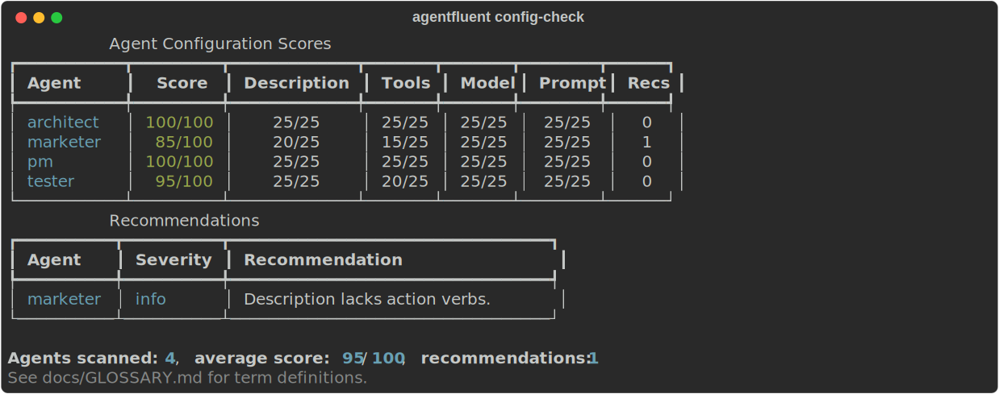
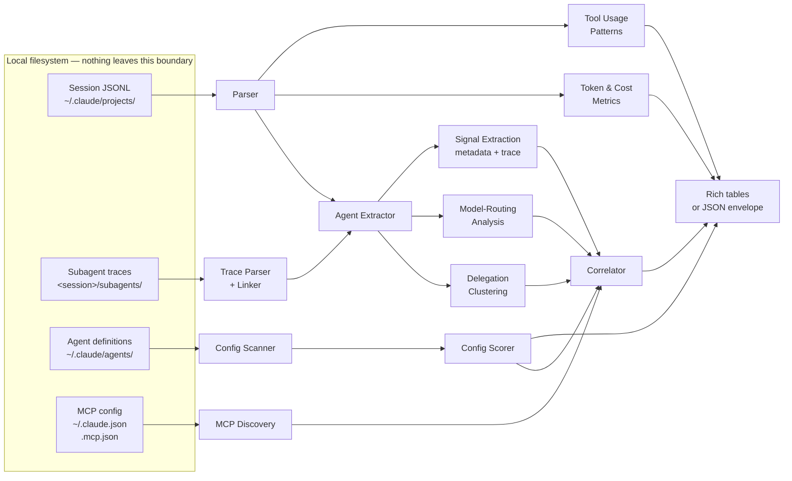

# AgentFluent

**Local-first agent analytics with behavior-to-improvement diagnostics. The tools that exist tell you what your agent did — AgentFluent tells you how to make it better.**

[](https://pypi.org/project/agentfluent/)
[](https://pypi.org/project/agentfluent/)
[](https://github.com/frederick-douglas-pearce/agentfluent/actions/workflows/ci.yml)
[](LICENSE)

AI agents are in production at 57% of organizations, and quality is the single top barrier to deployment. When an agent misbehaves — wrong tool choice, retry loops, hallucinated outputs — developers iterate on prompts blind. Existing observability platforms show *what* happened: traces, latency, token counts. They don't tell you *why* the agent misbehaved or *what in its configuration to change*.

AgentFluent reads your local [Claude Code](https://code.claude.com) and [Claude Agent SDK](https://code.claude.com/docs/en/agent-sdk/overview) session JSONL, extracts agent invocations and tool patterns, scores each agent's configuration against a best-practice rubric, and correlates observed behavior back to specific fixes — a prompt gap, a missing tool constraint, or a stale model selection. No cloud services, no API keys, no data leaves your machine.

Born from [CodeFluent](https://github.com/frederick-douglas-pearce/codefluent) research that identified the agent-quality gap in 2026. See [`docs/AGENT_ANALYTICS_RESEARCH.md`](docs/AGENT_ANALYTICS_RESEARCH.md) for additional market analysis.

## What AgentFluent Scores

Every recommendation lands on one of three axes. CLI output prefixes each finding with `[cost]`, `[speed]`, or `[quality]` so you can prioritize by what matters right now:

| Axis | What it tracks | Example finding |
|------|----------------|-----------------|
| **`[cost]`** | tokens, cache efficiency, model fit, offload candidates | This agent uses Opus where Sonnet would do |
| **`[speed]`** | duration, retry density, tool-call churn, stuck patterns | This agent retries Bash 5× before giving up |
| **`[quality]`** | user mid-flight corrections, file rework, reviewer-caught rate | This agent ships work that gets immediately rewritten |

The three often trade off — saving cost can hurt quality, chasing speed can hurt cost. AgentFluent surfaces the trade-off rather than collapsing it to a single score.

## How It Compares

The agent observability space is crowded — several tools capture what agents do. None diagnose *why* they misbehave or *what to change* from locally-persisted session data. In the table below, **"What's missing"** is what the tool *does not do* (not what it provides):

| Tool | What it measures | What's missing |
|------|-----------------|----------------|
| [Langfuse](https://langfuse.com) / [LangSmith](https://smith.langchain.com) / [Arize Phoenix](https://phoenix.arize.com) | Production traces, latency, token counts, errors | Behavior-to-prompt diagnosis; local agent config audit |
| [Braintrust](https://braintrust.dev) / [Galileo](https://www.galileo.ai) / [DeepEval](https://www.deepeval.com) | LLM-as-judge scoring against rubrics | Requires cloud instrumentation and author-provided test sets; no local agent config audit |
| [ccusage](https://github.com/ryoppippi/ccusage) / [claude-code-analytics](https://github.com/d-k-patel/claude-code-analytics) / [agents-observe](https://github.com/agents-observe/agents-observe) | Usage stats, token counts, subagent trees | Quality scoring; actionable config recommendations |
| [claude-code-otel](https://github.com/ColeMurray/claude-code-otel) | OpenTelemetry export of Claude Code sessions | Analysis itself — it's a bridge to other tools |
| Anthropic Console | Per-request cost, rate-limit tracking | Session-level diagnostics; agent config recommendations |

**Where AgentFluent fits.** AgentFluent reads the session JSONL your agent already produced, scores each agent's configuration against a best-practice rubric, and correlates observed behavior back to the specific config line that most likely explains it. It complements the tools above rather than replacing them — use Langfuse/Phoenix for production traces, Braintrust for test-set evals, ccusage for usage dashboards, and AgentFluent for *what in the agent's config to change*. The question *"my Agent SDK agent ran 500 sessions last week — were any of them actually good, and how can I update my agent's configuration to make it better?"* has no answer from the tools above. AgentFluent is built to answer it.

## Why This Is Different

- **Research-grounded.** Every diagnostic maps to a specific gap in the agent's prompt, tool list, or model selection — not vibes. See the [research doc](docs/AGENT_ANALYTICS_RESEARCH.md) for the feasibility and positioning analysis.
- **Behavior-to-improvement, not just traces.** When the agent retries Bash 40% of the time, AgentFluent tells you *which prompt clause is missing* — not just that the retry happened.
- **The config is the agent.** In interactive sessions, the human course-corrects. In programmatic agents, the prompt and tool setup *are* the agent — a flaw compounds at scale. AgentFluent scores description, tools (`allowed_tools` / `disallowedTools`), model, and prompt on every agent definition, and audits MCP server configuration (configured-but-unused, observed-but-missing) against real tool usage. Hook coverage and cross-agent pattern detection are on the roadmap.
- **Local-first and private.** All analysis runs on your machine. Zero outbound network calls. No API key required.
- **CLI-native.** `agentfluent analyze --format json | jq ...` — fits agent developer workflows (terminal, CI/CD, PR checks) without a web dashboard dependency.
- **JSON output envelope is a contract.** A stable `{version, command, data}` schema lets you build PR gates, trend dashboards, and regression detectors on top without tracking AgentFluent's internal refactors.
- **Correct cost accounting.** Distinguishes pay-per-token API rate from subscription plan flat cost, with per-model pricing that AgentFluent actively maintains ([#80](https://github.com/frederick-douglas-pearce/agentfluent/issues/80) will add per-session historical pricing).
- **CodeFluent sibling.** Shares the JSONL parsing heritage but asks a different question. CodeFluent scores *human* AI fluency in interactive sessions; AgentFluent scores *agent* quality and tells you what configuration to change. Not forked — two products with a common data source.

## AgentFluent vs CodeFluent

Both read `~/.claude/projects/` session JSONL. They answer different questions:

| | [CodeFluent](https://github.com/frederick-douglas-pearce/codefluent) | AgentFluent |
|---|---|---|
| **Unit of analysis** | Conversations in interactive sessions, plus the supporting `.claude/` config (CLAUDE.md, rules, hooks, commands) | Agent definitions + their observed behavior |
| **Scoring target** | Developer's AI collaboration fluency and project-config maturity | Agent's prompt, tools, model, hooks |
| **Feedback loop** | Coaches the human to interact with Claude Code better | Tells the developer what config to change |
| **Delivery** | VS Code extension + web app | CLI-first (dashboard deferred) |
| **API calls** | Anthropic API for LLM-as-judge scoring | None — fully local |

If you write your own prompts each session, use CodeFluent. If your prompts live in `ClaudeAgentOptions`, `AgentDefinition`, or `.claude/agents/*.md` files, use AgentFluent.

## Screenshots

**Execution Analytics** — `agentfluent analyze --project <name> --no-diagnostics`



**Behavior Diagnostics** — `agentfluent analyze --project <name>` (diagnostics on by default)



**Suggested Subagents with copy-paste-ready YAML draft** — `agentfluent analyze --project <name> --verbose`



**Comparison Workflow** — `agentfluent diff baseline.json current.json`



**Config Assessment** — `agentfluent config-check`



<sub>Screenshots are regenerated from real session data via <code>scripts/generate_readme_screenshots.py</code>.</sub>

## Getting Started

### Prerequisites

- **Python 3.12 or newer.** Check with `python --version`.
- **Claude Code or Agent SDK session data.** Generated automatically at `~/.claude/projects/` whenever you use Claude Code or run an Agent SDK script — nothing to configure.
- **Platforms:** Linux, macOS, Windows. Pure-Python package; the path handling resolves `~/.claude/` on every platform.

### Install

```bash
# Preferred — isolated tool install via uv (https://docs.astral.sh/uv/)
uv tool install agentfluent

# Fallback — pip into a venv of your choice
pip install agentfluent

# Zero-install one-shot
uvx agentfluent list
```

#### Optional extras

- **`agentfluent[clustering]`** — installs `scikit-learn` and enables delegation clustering, which proposes new specialized subagents from recurring `general-purpose` invocations. Without this extra, `agentfluent analyze --diagnostics` still runs all other diagnostics, but `delegation_suggestions` is always empty in JSON output and the "Suggested Subagents" section is omitted from terminal output. Install with `uv tool install 'agentfluent[clustering]'` or `pip install 'agentfluent[clustering]'`.

### First run

```bash
# Discover which projects have session data
agentfluent list

# Analyze agent behavior + cost in a specific project
agentfluent analyze --project myproject

# Score your agent definitions against the config rubric
agentfluent config-check
```

## Commands

### `agentfluent list` — discover projects and sessions

```bash
agentfluent list                                     # All projects
agentfluent list --project codefluent                # Sessions in one project
agentfluent list --format json | jq '.data.projects[].name'
```

Lists every Claude Code / Agent SDK project found under `~/.claude/projects/`, with session counts, total size, and last-modified timestamp. Pass `--project` to drill into one project and list its individual session files.

### `agentfluent analyze` — token, cost, and behavior metrics

```bash
agentfluent analyze --project codefluent                       # Full analysis with behavior diagnostics
agentfluent analyze --project codefluent --no-diagnostics      # Token + cost only (skip diagnostics pipeline)
agentfluent analyze --project codefluent --agent pm            # Filter to one subagent
agentfluent analyze --project codefluent --latest 5            # Last 5 sessions only
agentfluent analyze --project codefluent --since 7d            # Sessions from the last 7 days only (v0.6)
agentfluent analyze --project codefluent --since 2026-05-01 --json > baseline.json  # Time-scoped baseline for diff
agentfluent analyze --project codefluent -v                    # + YAML subagent drafts
agentfluent analyze --project codefluent --min-severity warning  # Hide info-level recs
agentfluent analyze --project codefluent --top-n 10            # Top-10 priority fixes summary block
agentfluent analyze --project codefluent --format json | jq '.data.token_metrics.total_cost'

# Save the top-confidence cluster as a real subagent definition:
agentfluent analyze --project codefluent --format json \
  | jq -r '.data.diagnostics.delegation_suggestions[0].yaml_draft' \
  > ~/.claude/agents/new-agent.md
```

Produces a token-usage table, per-model cost breakdown (labeled as API rate — subscription plans differ), tool usage concentration, and an Agent Invocations table summarizing each subagent's token, duration, and tool-use count. The Cost by Model table breaks out parent vs subagent rows (a model used in both shows two rows with `Origin` distinguishing them), and the top-line `Total cost` / `Total tokens` are comprehensive — parent thread + linked subagent runs combined. Behavior diagnostics run by default and surface signals across three layers (pass `--no-diagnostics` to skip):

- **Metadata-level** (from invocation summaries): tool-error keywords, token-per-tool-use outliers, duration outliers.
- **Trace-level** (from `~/.claude/projects/<session>/subagents/`): retry loops, stuck patterns, permission failures, consecutive tool-error sequences — each with per-tool-call evidence.
- **Aggregate**: model mismatch (complexity class wrong for declared/observed model), delegation clustering (recurring `general-purpose` patterns → proposed specialized subagents), MCP server audit (configured-but-unused, observed-but-missing).
- **Quality (v0.6)**: parent's mid-flight corrections (`USER_CORRECTION`), file rework density (`FILE_REWORK`), and reviewer-caught rate with `parent_acted` attribution (`REVIEWER_CAUGHT`). Recommendations carry a `[quality]` axis label and per-recommendation `axis_scores` annotations.

Above the Recommendations table, a **Top-N priority fixes summary** ranks findings by a composite `priority_score` that combines severity, occurrence count, cost impact (for `target='model'` mismatches), trace-evidence boost, and (v0.6) quality-evidence boost — so the highest-leverage changes surface first instead of asking the reader to scan a flat severity-sorted list. The sort key is part of the JSON envelope (`aggregated_recommendations[].priority_score`), so a CI gate can fail the run on priority regression. An **Offload Candidates** section calls out clusters of repeating tool-use patterns in the parent thread and proposes subagent / skill drafts that move that work onto cheaper-tier models — the dominant cost lever for users running agents at scale.

Each recommendation surfaces an axis label — `[cost]`, `[speed]`, or `[quality]` — naming which diagnostics axis triggered it. The JSON envelope exposes the same information per recommendation as `axis_scores: {cost, speed, quality}` and `primary_axis`, so a CI rule can target a specific dimension (e.g. fail only on new `quality`-primary findings).

Near-duplicate recommendations are aggregated per `(agent, target, signal)` shape into one row with an occurrence `Count` and metric range (e.g. *"4 invocations (4.9x–8.0x above 5,064 mean). Consider adding more specific instructions..."*). Each recommendation carries a specific config surface to change (prompt, tools, model, mcp) and a pointer to the file to edit. Recommendations for built-in agents (Explore, general-purpose, Plan, etc.) use concern-specific action text — wrapper subagent for scope issues, retry bounds on the delegating agent for recovery issues, reroute for tools/model — since built-in agents have no user-editable prompt or tool config.

Cost numbers reflect current per-token pricing; historical sessions are priced at today's rates until [#80](https://github.com/frederick-douglas-pearce/agentfluent/issues/80) (time-series pricing) lands.

### `agentfluent diff` — compare two analyze runs

```bash
agentfluent analyze --project codefluent --json > baseline.json   # before a prompt change
# ... edit agent prompts / tools / model ...
agentfluent analyze --project codefluent --json > current.json    # after the change

agentfluent diff baseline.json current.json                       # side-by-side report
agentfluent diff baseline.json current.json --fail-on critical    # CI gate: exit 3 only on new critical findings
agentfluent diff baseline.json current.json --json | jq '.data.regression_detected'
```

Compares two `analyze --json` envelopes and surfaces new, resolved, and persisting recommendations (keyed by `(agent_type, target, signal_types)`), token / cost deltas, and per-agent invocation deltas. The `--fail-on {info|warning|critical|off}` flag gates exit code 3 on new findings at or above the chosen severity, so `agentfluent diff` slots into a PR check the same way a test runner does. Baselines are user-managed files — no internal cache — so re-running against an older snapshot at any time is just `agentfluent diff old.json new.json`.

### `agentfluent report` — render an analyze snapshot as Markdown

```bash
agentfluent analyze --project codefluent --json > snap.json   # capture a snapshot
agentfluent report snap.json                                  # Markdown to stdout
agentfluent report snap.json --output report.md               # ...or to a file
agentfluent analyze --project codefluent --json | agentfluent report /dev/stdin   # one-shot pipe
```

Renders an `analyze --json` snapshot envelope as a Markdown document — the same Summary / Token Metrics / Agent Metrics / Diagnostics / Offload / Reproduction sections that `analyze` prints to the terminal, but in a form you can paste into a PR comment, attach as a CI artifact, or commit alongside a prompt change as a checked-in review trail. `report` is a separate subcommand rather than `analyze --format markdown` so the rendering layer stays decoupled from session ingestion: snapshots round-trip through file storage without re-running analysis. The Reproduction footer always echoes the original `agentfluent analyze` command line so a downstream reader can reproduce the run.

### `agentfluent config-check` — score agent definitions

```bash
agentfluent config-check                          # All user + project agents
agentfluent config-check --scope user             # Only ~/.claude/agents/
agentfluent config-check --agent pm --verbose     # One agent with detailed recs
agentfluent config-check --format json | jq '.data.scores[] | select(.overall_score < 60)'
```

Walks `~/.claude/agents/*.md` and `./.claude/agents/*.md`, parses each agent's YAML frontmatter and body, and scores against a 4-dimension rubric (description trigger quality, tool access appropriateness, model selection, prompt completeness). Outputs a score per agent plus ranked recommendations — e.g. "Prompt body doesn't mention error handling."

### Glossary

`analyze --diagnostics` and `config-check` introduce AgentFluent-specific vocabulary (signal types, severity, confidence tiers, recommendation targets). [`docs/GLOSSARY.md`](docs/GLOSSARY.md) defines every term that appears in CLI output, with worked examples and detection thresholds.

## Configuration

AgentFluent's "configuration" is CLI flags — no config file, no environment variables beyond the defaults. Sensible defaults keep most invocations flagless.

| Flag | Default | What it controls |
|------|---------|-----------------|
| `--project` | (required on `analyze`) | Filter to a specific project slug or display name |
| `--scope` | `all` | `config-check` scope: `user`, `project`, or `all` |
| `--agent` | (none) | Filter `analyze` or `config-check` to one subagent type |
| `--latest N` | (all sessions) | `analyze` only the N most recent sessions |
| `--since DATETIME` | (none) | `analyze`/`list`: include sessions whose first message landed at or after this time. ISO 8601, date-only (`YYYY-MM-DD`), or relative (`7d`, `12h`, `30m`). Half-open interval with `--until`. Mutually exclusive with `--session`. |
| `--until DATETIME` | (none) | `analyze`/`list`: include sessions whose first message landed strictly before this time. Same formats as `--since`. |
| `--session` | (all) | `analyze` a specific session filename within the project |
| `--diagnostics / --no-diagnostics` | on | `analyze`: behavior-correlation signals (default on; `--no-diagnostics` skips the pipeline) |
| `--min-cluster-size` | 5 | Delegation clustering: minimum invocations per cluster (requires `agentfluent[clustering]`) |
| `--min-similarity` | 0.7 | Delegation dedup: cosine-similarity threshold against existing agents |
| `--top-n N` | 5 | `analyze`: number of priority-ranked recommendations to summarize above the Recommendations table. Pass 0 to disable the summary block. |
| `--min-severity` | (none) | `analyze`: drop recommendations below `info` / `warning` / `critical`. Filters both the default table and the `--verbose` per-invocation surface; signals are not affected. |
| `--fail-on` | (none) | `diff`: gate exit code 3 on new recommendations at or above `info` / `warning` / `critical`, or `off` to disable. |
| `--claude-config-dir` | `~/.claude/` | Override the Claude config root (also honors `$CLAUDE_CONFIG_DIR`) |
| `--format` | `table` | Output format: `table` (Rich) or `json` (envelope). Shortcut: `--json` (equivalent to `--format json`) |
| `--verbose` | off | Extra detail: per-session breakdown, per-invocation detail, raw (un-aggregated) recommendations, and YAML subagent drafts for suggested clusters |
| `--quiet` | off | Suppress non-essential output (useful in CI) |

## Output formats

**Default (table):** Rich-rendered tables in the terminal, designed to be readable at a glance. Colors auto-adapt to terminal theme.

**JSON envelope (`--format json`, or the shortcut `--json`):** Stable schema `{version, command, data}` intended as a contract — pipe to `jq`, integrate with CI, build regression gates on top. Example:

```json
{
  "version": "2",
  "command": "analyze",
  "data": {
    "window": {
      "since": "2026-05-01T00:00:00Z", "until": null,
      "session_count_before_filter": 42, "session_count_after_filter": 12
    },
    "token_metrics": {
      "total_cost": 41.11,
      "total_tokens": 54019983,
      "by_model": [
        {"model": "claude-opus-4-7", "origin": "parent",   "cost": 30.68, "input_tokens": 6829, ...},
        {"model": "claude-opus-4-7", "origin": "subagent", "cost":  1.50, "input_tokens": 1213, ...},
        {"model": "claude-opus-4-6", "origin": "subagent", "cost":  8.93, "input_tokens": 7825, ...}
      ]
    },
    "tool_usage": [...],
    "agent_invocations": [...],
    "diagnostics": {
      "aggregated_recommendations": [
        {
          "agent_type": "general-purpose",
          "target": "subagent",
          "signal_types": ["user_correction"],
          "primary_axis": "quality",
          "axis_scores": {"cost": 0.0, "speed": 0.0, "quality": 14.0},
          "priority_score": 226.0,
          "severity": "warning",
          "count": 7,
          "message": "user_correction: Consider delegating to a review-style subagent ..."
        },
        ...
      ],
      "offload_candidates": [...],
      "delegation_suggestions": [...],
      "delegation_suggestions_skipped_reason": null
    }
  }
}
```

**Schema v2 (v0.5):** `token_metrics.by_model` changed from a dict keyed by model name to a list of rows where each row carries an `origin` field (`"parent"` or `"subagent"`). Two rows can share a model with different origins (Opus used in both parent and subagent runs). Top-level `total_cost` and `total_tokens` are now comprehensive — they include subagent contributions. `agentfluent diff` reads both v1 and v2 envelopes (legacy v1 rows normalize as `origin="parent"`), so saved baselines remain diffable across the upgrade.

**Schema v2 additions (v0.6, additive — no version bump):** Each `aggregated_recommendations` row carries `axis_scores: {cost, speed, quality}` and `primary_axis: "cost" | "speed" | "quality"`. The composite `priority_score` formula gains a `quality_evidence_factor * W_QUALITY` term that fires when a recommendation's signals map to the `quality` axis (per D021). `analyze --json` output also carries a top-level `window: {since, until}` block when `--since`/`--until` is set on the invocation (`null` for either bound when not specified). `agentfluent diff` reads pre-v0.6 envelopes without these annotations cleanly — the absence is treated as zeros / `cost`-primary, which preserves the existing comparison semantics.

No ANSI escapes in JSON output, guaranteed. The key `total_cost` is the pay-per-token equivalent; subscribers on Pro/Max/Team/Enterprise plans see a flat monthly charge regardless.

## How It Works



Step by step:

1. **Parse JSONL** — `core/parser.py` reads each session file into typed `SessionMessage` objects. Handles streaming snapshot deduplication, plain-string vs. array content shapes, and Claude Code's real `toolUseResult` format (see [`CLAUDE.md`](CLAUDE.md) for the format spec).
2. **Parse subagent traces** — `traces/parser.py` reads per-session subagent files under `<session>/subagents/agent-<agentId>.jsonl` and reconstructs the internal tool-call sequence with `is_error` flags. `traces/linker.py` attaches each trace back to its parent invocation via `agentId`. `traces/retry.py` detects retry sequences within a trace.
3. **Discover projects and sessions** — `core/discovery.py` enumerates `~/.claude/projects/` and surfaces friendly display names.
4. **Extract agent invocations** — `agents/extractor.py` walks messages, pairs Agent `tool_use` blocks with their `tool_result` content blocks, and pulls per-invocation metadata (tokens, duration, tool-use count) from the containing user message's `toolUseResult` sibling.
5. **Compute token and cost metrics** — `analytics/tokens.py` aggregates usage per model with `<synthetic>` sentinel filtering; `analytics/pricing.py` applies per-token rates labeled as API rate.
6. **Score agent configurations** — `config/scanner.py` parses YAML frontmatter from each `.md` in `.claude/agents/` and `~/.claude/agents/`; `config/scoring.py` scores description, tools, model, and prompt on a 4-dimension rubric.
7. **Discover MCP servers** — `config/mcp_discovery.py` reads `mcpServers` from `~/.claude.json` (user + project-local scopes) and `.mcp.json` (project-shared), honoring the `enabledMcpjsonServers` / `disabledMcpjsonServers` gating arrays. Used by the audit phase to compare against observed `mcp__*` tool usage.
8. **Diagnose behavior** — `diagnostics/` extracts metadata signals (`signals.py`), trace-level signals (`trace_signals.py` — retry loops, stuck patterns, permission failures, error sequences), model-routing mismatches (`model_routing.py`), and MCP audit signals (`mcp_assessment.py`). `correlator.py` routes each signal to a config target (prompt/tools/model/mcp) and emits an actionable recommendation.
9. **Propose new subagents** — `diagnostics/delegation.py` clusters recurring `general-purpose` invocations via TF-IDF + KMeans and drafts candidate subagent definitions with name, model, tool list, and prompt scaffold. Under `--verbose`, each draft is emitted as a copy-paste-ready YAML frontmatter block. Deduped against existing agents by cosine similarity.
10. **Render** — `cli/formatters/table.py` emits Rich tables; `cli/formatters/json.py` emits the stable JSON envelope. Format is selected by `--format`.

Everything runs locally. No outbound network calls, ever. No API key needed.

## Features

- **Project and Session Discovery** — Enumerates `~/.claude/projects/`, groups sessions by project, shows per-project session count, total size, and last-modified timestamp. Handles Claude Code subagent sidechain files and Agent SDK sessions uniformly.
- **Execution Analytics** — Token usage, API-rate cost, cache efficiency, per-model breakdown, tool-call concentration, and per-agent invocation metrics (tokens, duration, tool-use count). Cache creation and cache read tokens are tracked separately so you can see where your prompt caching is working.
- **Comprehensive Cost Attribution** — Top-line `total_cost` and `total_tokens` reflect parent + subagent runs combined. The per-model breakdown decomposes by `(model, origin)` so a user who sees "100% Opus" can tell whether their Haiku-routed Explore subagent contributed cost, and whether Opus spend lives in the parent thread or a delegated agent. JSON envelope is at schema v2.
- **Agent Config Assessment** — 4-dimension rubric (description, tools, model, prompt) applied to every `.md` file in `~/.claude/agents/` and `./.claude/agents/`. Produces a 0–100 score plus ranked, specific recommendations ("Prompt body doesn't mention error handling"). Catches agents that are technically valid but miss well-known best practices.
- **Subagent Trace Parsing** — Parses the internal tool-call sequences Claude Code emits under `~/.claude/projects/<session>/subagents/agent-<agentId>.jsonl`, links them back to the delegating invocation, and detects retry sequences. Gives diagnostics per-call evidence (which tool, which attempt, which error) instead of just an invocation-level summary.
- **Behavior Diagnostics** — `--diagnostics` emits signals across three layers. *Metadata*: tool-error keywords, token-per-tool-use outliers, duration outliers. *Trace-level*: retry loops, stuck patterns (same call repeated with no progress), permission failures, consecutive tool-error sequences. *Aggregate*: model mismatch (declared/observed model wrong for the workload's complexity), MCP server audit (configured-but-unused, observed-but-missing). Near-duplicate recommendations collapse into one row per `(agent, target, signal)` shape with an occurrence `Count` and metric range. Recommendations for built-in agents (Explore, general-purpose, Plan, code-reviewer, etc.) use concern-specific action text since built-ins have no user-editable config. Each signal routes to a `target` config surface — prompt, tools, model, or mcp — and the recommendation names the file to edit and the specific change to make.
- **Quality Axis (v0.6)** — A third diagnostics axis alongside cost and speed, surfacing gaps that look "free" by token math but produce quality debt. Tier-1 signals (no new data sources): `USER_CORRECTION` (parent's mid-flight corrections like "no, do X instead"), `FILE_REWORK` (same file edited at or above the calibrated threshold within a session), and `REVIEWER_CAUGHT` (substantive findings from architect/security-review/tester subagents, with `parent_acted` attribution). Recommendations carry a `[quality]` axis label, and per-recommendation `axis_scores: {cost, speed, quality}` plus `primary_axis` annotations let CI rules and `agentfluent diff` reason about which dimension changed. Single-axis classification keeps the same threshold meaning the same thing across surfaces. Calibrated against the dogfood corpus (see [`scripts/calibration/`](scripts/calibration/)).
- **Date-Range Filtering (v0.6)** — `--since`/`--until` on `agentfluent analyze` and `agentfluent list` scope analysis to a session window using ISO 8601, date-only (`YYYY-MM-DD`), or relative (`7d`, `12h`, `30m`) input. Half-open interval semantics (consistent with `git log` and time-series conventions). Closes the dogfood loop for "did my fix work?" workflows and enables retroactive baselines for `diff`. Analyze JSON output carries a `window: {since, until}` block when either flag is set.
- **Priority Ranking** — A composite `priority_score` ranks recommendations by severity, occurrence count, cost impact (model-mismatch findings carry the dollar savings), trace-evidence boost, and (v0.6) quality-evidence boost when quality-axis signals fire. The default Recommendations table is sorted by priority desc, and a Top-N priority-fixes summary surfaces above the table so the highest-leverage changes are the first thing the reader sees. `--top-n N` controls the summary depth; `--min-severity {info|warning|critical}` filters the recommendation surface without touching the underlying signals.
- **Offload Candidates** — Detects clusters of repeating tool-use patterns in the parent Claude Code thread, estimates the cost saved by routing them through a cheaper subagent or skill, and proposes a draft definition for each cluster. The dominant cost lever for users running agents at scale: a Sonnet thread that does 80 GitHub PR reviews per week is cheaper as a Haiku-routed `pr-review` subagent. Calibrated against real-world burst distributions (`scripts/calibration/`).
- **Comparison Workflow** — `agentfluent diff baseline.json current.json` compares two `analyze --json` envelopes, classifying each recommendation as `new` / `resolved` / `persisting`, computing token / cost / cache deltas, and emitting per-agent invocation deltas. `--fail-on {info|warning|critical}` gates exit code 3 on new findings at or above the chosen severity, so `agentfluent diff` slots into a PR check the same way a test runner does. Baselines are user-managed files — no internal cache — so re-running against an older snapshot at any time is just one command. Reads both v1 (legacy) and v2 (current) JSON envelopes via a compatibility shim.
- **Delegation Clustering** — TF-IDF + KMeans on recurring `general-purpose` invocations surfaces patterns that would benefit from their own specialized subagent. Proposes a complete draft: name, description, recommended model (with cost reasoning), tool list derived from the cluster's trace data, and a prompt-body scaffold. Under `--verbose`, each cluster emits a copy-paste-ready **YAML subagent definition block** (frontmatter + prompt body) that can be saved directly as `~/.claude/agents/<name>.md`. Low-confidence clusters are kept but prefixed with a `REVIEW BEFORE USE` comment so loose groupings don't land in production blindly. Confidence tiers (high/medium/low) are calibrated against real-world cohesion distributions from multi-contributor datasets. Suppresses drafts that overlap existing agents and annotates the overlap. Requires the optional `agentfluent[clustering]` extra.
- **Model-Routing Diagnostics** — Per-agent-type classification of observed complexity (tool-call counts, token footprint, error rate, write-tool presence) compared against the agent's declared model tier. Flags overspec (complex model on simple workload — cost savings estimate included) and underspec (simple model struggling). Consumes trace-based model inference when frontmatter is absent.
- **MCP Server Assessment** — Reads configured MCP servers from `~/.claude.json` (user + project-local) and `.mcp.json` (project-shared), honoring per-user enable/disable gating. Compares against observed `mcp__<server>__*` tool usage from both parent sessions and subagent traces. Emits `MCP_UNUSED_SERVER` (INFO, configured but zero calls) and `MCP_MISSING_SERVER` (WARNING, failing calls to an unconfigured server) signals with actionable recommendations.
- **JSON Output Envelope** — Stable `{version, command, data}` schema. No ANSI escapes. Intended as a programmatic contract for CI integration, PR gates, and regression tracking.
- **Quiet and Verbose Modes** — `--quiet` for CI-friendly one-line summaries; `--verbose` for per-session breakdown and per-invocation detail tables. Defaults target interactive humans.

## Privacy and Security

AgentFluent is designed so data stays on your machine. The attack surface is small by construction — no web server, no HTML rendering, no webview, no outbound network calls — but this table summarizes the layers that protect it anyway:

| Layer | Mechanism | Protects Against |
|-------|-----------|-----------------|
| Zero network calls | No outbound connections — all analysis is local | Data exfiltration |
| Path handling | All paths resolved within `~/.claude/` | Path traversal |
| Input validation | Pydantic models with strict type constraints | Malformed JSONL crashing the parser |
| Safe YAML loading | `yaml.safe_load` only | Arbitrary code execution via frontmatter |
| CI security review | Claude-powered review when `needs-security-review` label is added | New vulnerabilities |
| Automated testing | 730+ unit tests incl. security-focused cases | Regressions |

### Secrets handling

Claude Code persists every tool output to `~/.claude/projects/<slug>/*.jsonl` — including any `.env`, `credentials.json`, or shell rc file that Claude ever read. `.gitignore` does not protect against this. AgentFluent itself emits only aggregate metrics, so it cannot leak secrets that weren't already on disk — but because the tool *reads* that data, contributors working on AgentFluent risk re-leaking while they work.

This repo ships two Claude Code hooks in [`.claude/settings.json`](.claude/settings.json) to reduce that risk:

- **PreToolUse block** ([`.claude/hooks/block_secret_reads.py`](.claude/hooks/block_secret_reads.py)) — denies reads of `.env*`, `.envrc`, `credentials.json`, `secrets.{yaml,yml,json}`, `*.pem`, SSH private keys, and shell rc files. Blocks *before* execution, so the file's contents never enter the session transcript.
- **PostToolUse detect** ([`.claude/hooks/detect_secrets_in_output.py`](.claude/hooks/detect_secrets_in_output.py)) — scans tool output for `sk-ant-*`, `sk-proj-*`, `ghp_*`, `github_pat_*`, `AKIA*`, or `AIza*` patterns. If a match is found, blocks Claude from echoing or summarizing it. The raw value is already on disk at this point, so treat any caught value as compromised and rotate.

Any future AgentFluent feature that surfaces raw session content (diff viewers, prompt excerpts, recommendation snippets that quote session text) must re-apply secret-pattern redaction at the display layer — historical JSONL on users' machines may still contain pre-hook leaks.

See [`docs/SECURITY.md`](docs/SECURITY.md) for the full policy: leak vector, defense architecture, discipline rules, historical-leak audit one-liner, user-scope deployment, and the bypass surface the hooks do not cover.

## Tech Stack

- **Python 3.12+**
- **[Typer](https://typer.tiangolo.com) + [Rich](https://rich.readthedocs.io)** — CLI framework and terminal formatting
- **[Pydantic v2](https://docs.pydantic.dev)** — data models across module boundaries
- **[PyYAML](https://pyyaml.org)** — agent definition frontmatter parsing (`safe_load` only)
- **[pytest](https://pytest.org) + pytest-cov** — 730+ tests
- **[mypy](https://mypy.readthedocs.io) strict mode** — full type coverage
- **[ruff](https://docs.astral.sh/ruff/)** — linting and formatting
- **[uv](https://docs.astral.sh/uv/)** — package and dependency management

## Project Structure

```
src/agentfluent/
├── cli/                 # Typer app, commands, formatters (table + JSON envelope)
├── core/                # JSONL parser, session models, project/session discovery
├── agents/              # Agent invocation extraction and AgentInvocation model
├── analytics/           # Token/cost metrics, tool patterns, model pricing
├── config/              # Agent definition scanner + scoring + MCP server discovery
├── traces/              # Subagent trace parsing, linking, and retry detection
└── diagnostics/         # Behavior signals (metadata + trace), correlation,
                         # model routing, delegation clustering, MCP audit
```

Full architecture and conventions are documented in [`CLAUDE.md`](CLAUDE.md).

## Development

```bash
git clone https://github.com/frederick-douglas-pearce/agentfluent.git
cd agentfluent
uv sync
uv run agentfluent --help
```

### Testing

```bash
uv run pytest -m "not integration"            # 730+ unit tests (CI default)
uv run pytest                                 # Full suite incl. integration tests against your real ~/.claude/projects/
uv run pytest --cov=agentfluent               # With coverage
```

Integration tests (`tests/integration/`) are skipped in CI because they require real session data — they pass on contributor machines with populated `~/.claude/projects/`.

### Lint and type check

```bash
uv run ruff check src/ tests/
uv run mypy src/agentfluent/
```

Both must pass cleanly before a PR merges.

### CI/CD

Five GitHub Actions workflows run automatically:

- **CI** ([`ci.yml`](.github/workflows/ci.yml)) — Every PR: ruff, mypy strict, full unit-test suite. Must pass to merge.
- **Security Review** ([`security-review.yml`](.github/workflows/security-review.yml)) — Claude-powered security review of code-changing PRs, triggered by the `needs-security-review` label (re-trigger by removing and re-adding).
- **Claude Code Review** ([`claude-review.yml`](.github/workflows/claude-review.yml)) — AI-powered PR review, triggered by the `needs-review` label or `@claude` mentions.
- **Release Please** ([`release-please.yml`](.github/workflows/release-please.yml)) — Auto-generates release PRs with changelog and version bumps from [Conventional Commits](https://www.conventionalcommits.org/).
- **Dependabot Auto-Merge** ([`dependabot-auto-merge.yml`](.github/workflows/dependabot-auto-merge.yml)) — Auto-merges dependabot PRs once CI passes.

## Roadmap

**v0.2 (shipped):**
- Parser fix for real Claude Code `toolUseResult` shape ([#84](https://github.com/frederick-douglas-pearce/agentfluent/issues/84))
- Cost label clarity for subscription-plan users ([#76](https://github.com/frederick-douglas-pearce/agentfluent/issues/76))
- Pricing data correction + opus-4-7 + synthetic filter ([#75](https://github.com/frederick-douglas-pearce/agentfluent/issues/75))

**v0.3 (shipped):**
- Subagent trace parser ([E2](https://github.com/frederick-douglas-pearce/agentfluent/issues/98)) — reconstructs the full internal tool-call sequence per subagent with `is_error` flags and retry detection, linked back to the delegating invocation.
- Deep diagnostics engine ([E3](https://github.com/frederick-douglas-pearce/agentfluent/issues/99)) — trace-level signals: retry loops, stuck patterns, permission failures, consecutive tool-error sequences, each carrying per-tool-call evidence.
- Delegation clustering ([#92](https://github.com/frederick-douglas-pearce/agentfluent/issues/92)) — TF-IDF + KMeans over recurring `general-purpose` invocations; proposes complete draft subagent definitions deduped against existing agents.
- Model-routing diagnostics ([#95](https://github.com/frederick-douglas-pearce/agentfluent/issues/95)) — per-agent-type complexity classification vs. declared model; overspec/underspec flags with cost-savings estimates. Trace-based model inference when frontmatter is absent.
- MCP server assessment ([#100](https://github.com/frederick-douglas-pearce/agentfluent/issues/100)) — configured-vs-observed audit with `MCP_UNUSED_SERVER` and `MCP_MISSING_SERVER` signals.
- Recommendation aggregation ([#165](https://github.com/frederick-douglas-pearce/agentfluent/issues/165)) — near-duplicate rows collapse per `(agent, target, signal)` shape with occurrence count and metric range; raw list preserved for `--verbose` and JSON drill-down.
- Built-in vs custom agent differentiation ([#166](https://github.com/frederick-douglas-pearce/agentfluent/issues/166)) — concern-specific action text (scope / recovery / tools / model) for built-in agents that have no user-editable config; nine of ten correlation rules updated.
- YAML subagent draft in `--verbose` ([#168](https://github.com/frederick-douglas-pearce/agentfluent/issues/168)) — copy-paste-ready `~/.claude/agents/<name>.md` block for each cluster; exposed as `yaml_draft` field in `--format json` for jq-pipe workflows.
- Cluster confidence re-calibration ([#167](https://github.com/frederick-douglas-pearce/agentfluent/issues/167)) — thresholds validated against two real datasets; MEDIUM now surfaces actionable candidates instead of everything landing in LOW.
- Aggregated row signal-type clarity ([#181](https://github.com/frederick-douglas-pearce/agentfluent/issues/181)) — same-(agent, target) rows that fire on different signals now name the trigger in the prefix (e.g., `tool_error_sequence:` vs `retry_loop:`) instead of looking interchangeable.
- Unknown-agent attribution fix ([#169](https://github.com/frederick-douglas-pearce/agentfluent/issues/169)) — invocations missing `subagent_type` (older skills, certain Claude Code versions) now correctly default to `general-purpose` instead of falling out of clustering as "unknown".
- `--claude-config-dir` flag and `$CLAUDE_CONFIG_DIR` env var for non-default session paths ([#90](https://github.com/frederick-douglas-pearce/agentfluent/issues/90)).
- Empirical threshold calibration via a committed Jupyter notebook ([#140](https://github.com/frederick-douglas-pearce/agentfluent/issues/140)).

**v0.4 (shipped):**
- In-product glossary — Phase 1 markdown reference + Phase 2 `agentfluent explain <term>` CLI subcommand ([#190](https://github.com/frederick-douglas-pearce/agentfluent/issues/190), [#191](https://github.com/frederick-douglas-pearce/agentfluent/issues/191)). Defines every term that appears in CLI output.
- Wait-time exclusion from duration metrics ([#230](https://github.com/frederick-douglas-pearce/agentfluent/issues/230)) — subtract idle gaps so duration-based outlier detection doesn't false-positive on user-input wait time.
- IQR-based outlier detection ([#186](https://github.com/frederick-douglas-pearce/agentfluent/issues/186), [#187](https://github.com/frederick-douglas-pearce/agentfluent/issues/187)) — replace naive mean-ratio with distribution-aware Q3+1.5·IQR, with `--verbose` distribution context.
- Bounded `is_error` regex fallback ([#238](https://github.com/frederick-douglas-pearce/agentfluent/issues/238)) — leading-window match on subagent trace results to suppress mid-text false positives.
- `PERMISSION_FAILURE` false-positive filter ([#231](https://github.com/frederick-douglas-pearce/agentfluent/issues/231)) — drops signals from hook-induced denials that don't reflect agent misbehavior.
- `--diagnostics` defaults on, `--json` shortcut, parse warnings to stderr ([#202](https://github.com/frederick-douglas-pearce/agentfluent/issues/202), [#196](https://github.com/frederick-douglas-pearce/agentfluent/issues/196), [#206](https://github.com/frederick-douglas-pearce/agentfluent/issues/206)).
- Cost surfacing on `by_agent_type` ([#200](https://github.com/frederick-douglas-pearce/agentfluent/issues/200)) — `total_cost_usd` + `avg_cost_per_invocation_usd` per agent.

**v0.5 (shipped — "Trustworthy Diagnostics"):**

The release theme: make diagnostic signals reliable enough that a user who doesn't know the internals can act on them without second-guessing.

- `agentfluent diff` ([#199](https://github.com/frederick-douglas-pearce/agentfluent/issues/199)) — comparison workflow with `--fail-on` for CI gates. The feature that makes AgentFluent habit-forming: re-run, diff, and a regression-check exit code lands the same way a test runner does.
- Priority ranking + Top-N priority fixes summary ([#172](https://github.com/frederick-douglas-pearce/agentfluent/issues/172)) — composite `priority_score` across severity, count, cost impact, and trace evidence; sorts the Recommendations table and powers the priority-fixes summary block.
- Parent-thread offload candidates ([#189](https://github.com/frederick-douglas-pearce/agentfluent/issues/189), [#256](https://github.com/frederick-douglas-pearce/agentfluent/issues/256)–[#260](https://github.com/frederick-douglas-pearce/agentfluent/issues/260)) — detect repeating parent-thread tool-bursts and propose subagent / skill drafts that move work onto cheaper-tier models. Dominant cost lever for users running agents at scale, calibrated against real burst distributions.
- `--min-severity` filter ([#205](https://github.com/frederick-douglas-pearce/agentfluent/issues/205)) — drop recommendations below `info` / `warning` / `critical` without affecting signals.
- `delegation_suggestions_skipped_reason` JSON field ([#215](https://github.com/frederick-douglas-pearce/agentfluent/issues/215)) — names *why* `delegation_suggestions` is empty (`sklearn_not_installed` / `insufficient_invocations` / `no_clusters_above_min_size`) so JSON consumers can distinguish "feature unavailable" from "ran but found nothing".
- Cost by Model includes subagent tokens, JSON schema v2 ([#227](https://github.com/frederick-douglas-pearce/agentfluent/issues/227)) — `by_model` becomes a list with an `origin` field per row, top-line `total_cost` is now comprehensive (parent + subagent), `agentfluent diff` reads both v1 and v2 envelopes via a compat shim.
- MCP `is_error` leading-window FP fix ([#241](https://github.com/frederick-douglas-pearce/agentfluent/issues/241)) — ports the #238 bound to MCP tool results, eliminating ~86% / ~63% false-positive rates measured against real GitHub-MCP-heavy projects.
- Outlier-detection recalibration + extractor consolidation ([#186](https://github.com/frederick-douglas-pearce/agentfluent/issues/186), [#235](https://github.com/frederick-douglas-pearce/agentfluent/issues/235)).
- Delegation-draft tools list frequency filter ([#184](https://github.com/frederick-douglas-pearce/agentfluent/issues/184)) — least-privilege tool inclusion so generated drafts don't request the union of every member's tools.
- Unified complexity classifier across model_routing and delegation ([#185](https://github.com/frederick-douglas-pearce/agentfluent/issues/185)).

**v0.6 (shipped — "Quality Axis: Tier 1"):**

The release theme adds a third diagnostics axis alongside cost and speed: **quality**. Review-style subagents (architect, tester, security-review, code-reviewer) were systematically under-recommended because their primary value is *independent context and quality improvement*, not token offload or wallclock savings — the existing recommendation engine couldn't see that benefit. v0.6 closes the gap. See PRD: [`.claude/specs/prd-quality-axis.md`](.claude/specs/prd-quality-axis.md). Tier-1 epic at [#268](https://github.com/frederick-douglas-pearce/agentfluent/issues/268), with decisions D015–D022 in [`.claude/specs/decisions.md`](.claude/specs/decisions.md).

- Tier-1 quality signals (no new data sources):
  - User mid-flight corrections ([#269](https://github.com/frederick-douglas-pearce/agentfluent/issues/269)) — frequency of "no, do X instead" / "wait" / "actually" patterns as a parent-quality miss-rate proxy. 3-tier heuristic (strong override / write-tool primary gate / question suppression) keeps the false-positive rate low.
  - File rework density ([#270](https://github.com/frederick-douglas-pearce/agentfluent/issues/270)) — same file edited at or above the calibrated threshold within a session as a missing-pre-implementation-review signal.
  - Reviewer-caught rate ([#271](https://github.com/frederick-douglas-pearce/agentfluent/issues/271)) — when architect / security-review / tester subagents do run, measure substantive findings and whether the parent acted on them. Suffix-match between mentioned and edited paths bridges the relative-vs-absolute path mismatch (#322).
- Multi-axis priority scoring ([#272](https://github.com/frederick-douglas-pearce/agentfluent/issues/272)) — annotations approach per D017 + D021: the existing `priority_score` formula gains a `quality_evidence_factor * W_QUALITY` term, and per-axis `axis_scores: {cost, speed, quality}` plus `primary_axis` are exposed as post-hoc annotations. Schema-additive, preserves `diff` comparison semantics.
- Single-axis signal classification (D022) — every `SignalType` maps to exactly one axis (no cross-cutting), with the mapping pinned as a module-level `SIGNAL_AXIS_MAP` constant.
- CLI/JSON axis attribution ([#273](https://github.com/frederick-douglas-pearce/agentfluent/issues/273)) — recommendations name *which axis* triggered them (`[quality] 7 user corrections in 3 sessions — consider an architect agent for design review`). Surfaces in the Recommendations table, JSON envelope, and `agentfluent diff` output.
- Calibration sweep ([#274](https://github.com/frederick-douglas-pearce/agentfluent/issues/274)) — Tier-1 thresholds tuned against the dogfood corpus and validated post-fix in [#327](https://github.com/frederick-douglas-pearce/agentfluent/issues/327). USER_CORRECTION false-positive rate dropped from ~85% to 0/2 detections after pattern + wrapper-stripping fixes ([#321](https://github.com/frederick-douglas-pearce/agentfluent/issues/321), [#330](https://github.com/frederick-douglas-pearce/agentfluent/issues/330)); REVIEWER_CAUGHT `parent_acted` attribution went from 0/51 (0%) to 16/53 (30.2%) ([#322](https://github.com/frederick-douglas-pearce/agentfluent/issues/322)).
- Date-range filtering ([#293](https://github.com/frederick-douglas-pearce/agentfluent/issues/293) epic) — `--since`/`--until` on `agentfluent analyze` and `agentfluent list` (half-open interval, ISO 8601 / date-only / relative `7d`/`12h`/`30m` formats); `window: {since, until}` block on `analyze --json` output. Closes the dogfood loop on "did my config fix work?" and enables retroactive baselines for `diff`.
- Top-N priority fixes redesign ([#285](https://github.com/frederick-douglas-pearce/agentfluent/issues/285)) — the priority-fixes summary block above the Recommendations table now reads as a tight pointer list rather than re-stating the top rows.
- ERROR_REGEX windowing in two more sites ([#281](https://github.com/frederick-douglas-pearce/agentfluent/issues/281)) — `compute_error_rate` and `_extract_error_signals` now scan only the leading 200 chars of `output_text`, mirroring the #241 bound on MCP tool results. Drops `ERROR_PATTERN` signal volume by 98% on the dogfood corpus by suppressing mid-text matches against code identifiers and architectural prose.
- Burst-cluster error attribution ([#264](https://github.com/frederick-douglas-pearce/agentfluent/issues/264)) — `ToolBurst` now pairs `tool_use` to `tool_result` via the existing `index_tool_results_by_id` helper. Burst-classified clusters' `error_rate` reflects real paired-error data instead of always being 0.0; on the dogfood corpus 20.2% of bursts now carry at least one paired tool error, which unblocks the `_COMPLEX_MIN_ERROR_RATE` gate in `classify_complexity` for error-prone clusters.
- Tier-2 stretch ([#275](https://github.com/frederick-douglas-pearce/agentfluent/issues/275)) — deferred to v0.7 per [D028](.claude/specs/decisions.md). The Tier-1 signals close the under-recommendation gap on review subagents; FEAT_FIX_PROXIMITY would add confirming evidence and is the natural co-design with v0.7's Tier-3 GitHub enrichment.

**v0.7 (planned):**
- Tier-2 quality signal: local git feat→fix proximity ([#275](https://github.com/frederick-douglas-pearce/agentfluent/issues/275)) — detect feat-then-fix commit pairs on shared files and correlate back to whether the originating session used review subagents.
- Quality-axis Tier 3 — opt-in GitHub enrichment: PR review comment density and topic clustering on Claude-authored PRs, CI-failure-on-first-push rate, post-merge issue references.

**Future:**
- Time-series pricing data structure ([#80](https://github.com/frederick-douglas-pearce/agentfluent/issues/80)) + session-timestamp-aware cost calculation ([#81](https://github.com/frederick-douglas-pearce/agentfluent/issues/81)) + automated pricing updates ([#82](https://github.com/frederick-douglas-pearce/agentfluent/issues/82)).
- Agent SDK main-session MCP + tool extraction ([#112](https://github.com/frederick-douglas-pearce/agentfluent/issues/112)).
- Per-invocation token input/output split for more accurate cost estimates ([#143](https://github.com/frederick-douglas-pearce/agentfluent/issues/143)).
- Hosted documentation site ([#97](https://github.com/frederick-douglas-pearce/agentfluent/issues/97)).
- Hook coverage in the config rubric.
- Webapp dashboard for trend visualization.
- Closed-loop self-improvement — use AgentFluent's diagnostic output as a feedback signal the agent itself consumes to propose config edits against its own past sessions.
- Agent ROI reporting — roll up cost, usage, and task-completion signals over time so a business can evaluate whether an optimized agent is worth continuing to run.

Browse [open issues](https://github.com/frederick-douglas-pearce/agentfluent/issues) for the full backlog.

## Troubleshooting

| Problem | Solution |
|---------|----------|
| **No projects found** | Verify `~/.claude/projects/` exists and contains per-project subdirectories with `.jsonl` session files. Claude Code creates these automatically the first time you use it. |
| **No agent invocations** | Agent invocation rows require the session to actually call a subagent (`Agent` tool_use with a `subagent_type`). A session that never delegated has no agent data to analyze — this is not an error. |
| **Zero tokens / dashes in Agent Invocations** | If you're on AgentFluent ≤ 0.1.0, this is the [#84 parser bug](https://github.com/frederick-douglas-pearce/agentfluent/issues/84) — upgrade with `uv tool upgrade agentfluent`. |
| **Python version error** | AgentFluent requires Python 3.12+. Check with `python --version` and upgrade if needed. |
| **Non-default session path** | Pass `--claude-config-dir /path/to/.claude` or set `$CLAUDE_CONFIG_DIR` before invoking any command. The override applies to project discovery, agent configs, and MCP server discovery together. |
| **`Malformed JSON at <file>:<line>` warning** | A session file has a corrupted line — usually null bytes left behind when Claude Code was killed mid-write. The parser skips the line and continues; analytics are unaffected. Safe to ignore, or delete the line with `sed -i '<line>d' <file>` to silence the warning. |
| **Stale tool install after local build** | If `uv tool install --from <path> agentfluent` seems to reuse cached code, run `uv tool uninstall agentfluent && uv cache clean agentfluent` before reinstalling. |

## Research Foundations

AgentFluent's behavior-to-improvement approach is grounded in research on agent quality, observability gaps, and production failure modes:

- [`docs/AGENT_ANALYTICS_RESEARCH.md`](docs/AGENT_ANALYTICS_RESEARCH.md) — Full market analysis, competitive landscape (Langfuse, LangSmith, Arize, Braintrust, DeepEval, etc.), and technical feasibility study. This is the document that motivated AgentFluent's existence as a separate product from CodeFluent.
- [LangChain 2026 State of AI Agents](https://www.langchain.com/stateofaiagents) — 57% of orgs have agents in production; quality is the top blocker.
- [Anthropic Claude Agent SDK docs](https://code.claude.com/docs/en/agent-sdk/overview) — Agent configuration surface and best practices.
- [Anthropic Claude Code subagents docs](https://code.claude.com/docs/en/sub-agents) — Subagent definition format and delegation mechanics.

## Contributing

Contributions welcome. Start by reading [`CONTRIBUTING.md`](CONTRIBUTING.md) for dev setup, conventions, and the PR checklist. The [architecture overview in `CLAUDE.md`](CLAUDE.md) is the canonical reference for package layout, naming, and the JSONL format.

Branching: `feature/<issue>-description` for features, `fix/<issue>-description` for bugs. Commit messages follow [Conventional Commits](https://www.conventionalcommits.org/) — release-please uses them to cut versions and write the changelog automatically.

## License

[MIT](LICENSE)
