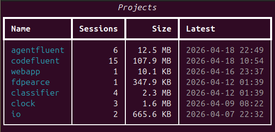
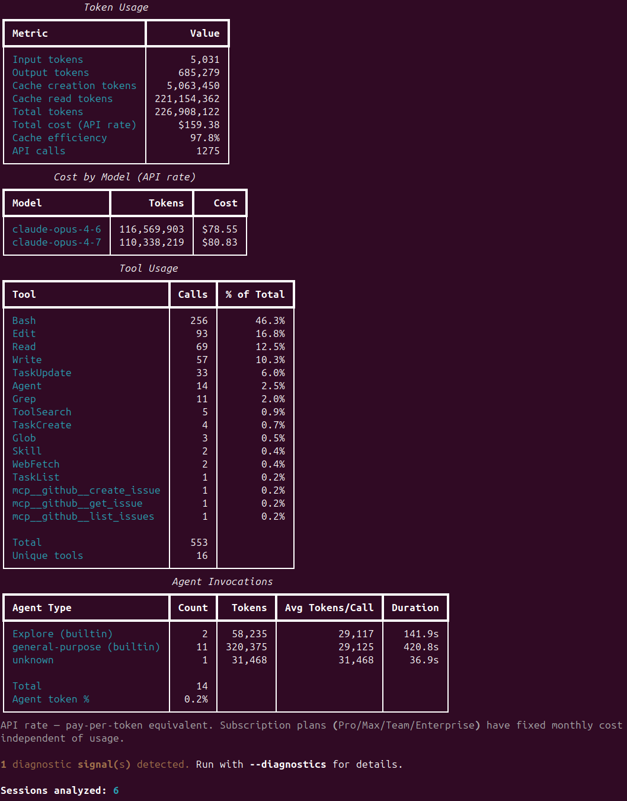
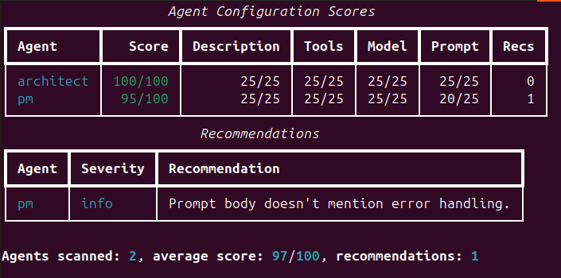
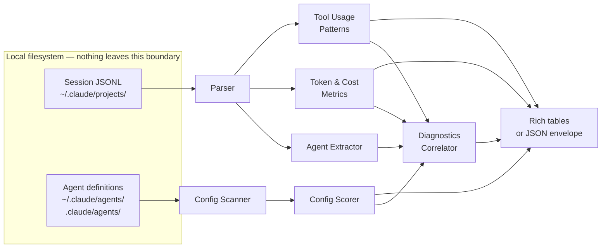

# AgentFluent

**Local-first agent analytics with behavior-to-improvement diagnostics. The tools that exist tell you what your agent did — AgentFluent tells you how to make it better.**

[](https://pypi.org/project/agentfluent/)
[](https://pypi.org/project/agentfluent/)
[](https://github.com/frederick-douglas-pearce/agentfluent/actions/workflows/ci.yml)
[](LICENSE)

AI agents are in production at 57% of organizations, and quality is the single top barrier to deployment. When an agent misbehaves — wrong tool choice, retry loops, hallucinated outputs — developers iterate on prompts blind. Existing observability platforms show *what* happened: traces, latency, token counts. They don't tell you *why* the agent misbehaved or *what in its configuration to change*.

AgentFluent reads your local [Claude Code](https://code.claude.com) and [Claude Agent SDK](https://code.claude.com/docs/en/agent-sdk/overview) session JSONL, extracts agent invocations and tool patterns, scores each agent's configuration against a best-practice rubric, and correlates observed behavior back to specific fixes — a prompt gap, a missing tool constraint, a stale model selection, a hook that never fires. No cloud services, no API keys, no data leaves your machine.

Born from [CodeFluent](https://github.com/frederick-douglas-pearce/codefluent) research that identified the agent-quality gap in 2026. See [`docs/AGENT_ANALYTICS_RESEARCH.md`](docs/AGENT_ANALYTICS_RESEARCH.md) for additional market analysis.

## How It Compares

The agent observability space is crowded — several tools capture what agents do. None diagnose *why* they misbehave or *what to change* from locally-persisted session data. In the table below, **"What's missing"** is what the tool *does not do* (not what it provides):

| Tool | What it measures | What's missing |
|------|-----------------|----------------|
| [Langfuse](https://langfuse.com) / [LangSmith](https://smith.langchain.com) / [Arize Phoenix](https://phoenix.arize.com) | Production traces, latency, token counts, errors | Behavior-to-prompt diagnosis; local agent config audit |
| [Braintrust](https://braintrust.dev) / [Galileo](https://www.galileo.ai) / [DeepEval](https://www.deepeval.com) | LLM-as-judge scoring against rubrics | Requires cloud instrumentation and author-provided test sets; no local agent config audit |
| [ccusage](https://github.com/ryoppippi/ccusage) / [claude-code-analytics](https://github.com/d-k-patel/claude-code-analytics) / [agents-observe](https://github.com/agents-observe/agents-observe) | Usage stats, token counts, subagent trees | Quality scoring; actionable config recommendations |
| [claude-code-otel](https://github.com/ColeMurray/claude-code-otel) | OpenTelemetry export of Claude Code sessions | Analysis itself — it's a bridge to other tools |
| Anthropic Console | Per-request cost, rate-limit tracking | Session-level diagnostics; agent config recommendations |

**Where AgentFluent fits.** AgentFluent reads the session JSONL your agent already produced, scores each agent's configuration against a best-practice rubric, and correlates observed behavior back to the specific config line that most likely explains it. It complements the tools above rather than replacing them — use Langfuse/Phoenix for production traces, Braintrust for test-set evals, ccusage for usage dashboards, and AgentFluent for *what in the agent's config to change*. The question *"my Agent SDK agent ran 500 sessions last week — were any of them actually good, and how can I update my agent's configuration to make it better?"* has no answer from the tools above. AgentFluent is built to answer it.

## Why This Is Different

- **Research-grounded.** Every diagnostic maps to a specific gap in the agent's prompt, tool list, model selection, or hook coverage — not vibes. See the [research doc](docs/AGENT_ANALYTICS_RESEARCH.md) for the feasibility and positioning analysis.
- **Behavior-to-improvement, not just traces.** When the agent retries Bash 40% of the time, AgentFluent tells you *which prompt clause is missing* — not just that the retry happened.
- **The config is the agent.** In interactive sessions, the human course-corrects. In programmatic agents, the prompt and tool setup *are* the agent — a flaw compounds at scale. AgentFluent scores the full surface: prompt, `allowed_tools`, `disallowedTools`, model, description, hook coverage.
- **Local-first and private.** All analysis runs on your machine. Zero outbound network calls. No API key required.
- **CLI-native.** `agentfluent analyze --format json | jq ...` — fits agent developer workflows (terminal, CI/CD, PR checks) without a web dashboard dependency.
- **JSON output envelope is a contract.** A stable `{version, command, data}` schema lets you build PR gates, trend dashboards, and regression detectors on top without tracking AgentFluent's internal refactors.
- **Correct cost accounting.** Distinguishes pay-per-token API rate from subscription plan flat cost, with per-model pricing that AgentFluent actively maintains ([#80](https://github.com/frederick-douglas-pearce/agentfluent/issues/80) will add per-session historical pricing).
- **CodeFluent sibling.** Shares the JSONL parsing heritage but asks a different question. CodeFluent scores *human* AI fluency in interactive sessions; AgentFluent scores *agent* quality and tells you what configuration to change. Not forked — two products with a common data source.

## AgentFluent vs CodeFluent

Both read `~/.claude/projects/` session JSONL. They answer different questions:

| | [CodeFluent](https://github.com/frederick-douglas-pearce/codefluent) | AgentFluent |
|---|---|---|
| **Unit of analysis** | Conversations in interactive sessions, plus the supporting `.claude/` config (CLAUDE.md, rules, hooks, commands) | Agent definitions + their observed behavior |
| **Scoring target** | Developer's AI collaboration fluency and project-config maturity | Agent's prompt, tools, model, hooks |
| **Feedback loop** | Coaches the human to interact with Claude Code better | Tells the developer what config to change |
| **Delivery** | VS Code extension + web app | CLI-first (dashboard deferred) |
| **API calls** | Anthropic API for LLM-as-judge scoring | None — fully local |

If you write your own prompts each session, use CodeFluent. If your prompts live in `ClaudeAgentOptions`, `AgentDefinition`, or `.claude/agents/*.md` files, use AgentFluent.

## Screenshots

<table>
<tr><th>Project Discovery</th><th>Execution Analytics</th></tr>
<tr valign="top">
  <td></td>
  <td></td>
</tr>
</table>

<table>
<tr><th>Config Assessment</th></tr>
<tr valign="top">
  <td></td>
</tr>
</table>

## Getting Started

### Prerequisites

- **Python 3.12 or newer.** Check with `python --version`.
- **Claude Code or Agent SDK session data.** Generated automatically at `~/.claude/projects/` whenever you use Claude Code or run an Agent SDK script — nothing to configure.
- **Platforms:** Linux, macOS, Windows. Pure-Python package; the path handling resolves `~/.claude/` on every platform.

### Install

```bash
# Preferred — isolated tool install via uv (https://docs.astral.sh/uv/)
uv tool install agentfluent

# Fallback — pip into a venv of your choice
pip install agentfluent

# Zero-install one-shot
uvx agentfluent list
```

### First run

```bash
# Discover which projects have session data
agentfluent list

# Analyze agent behavior + cost in a specific project
agentfluent analyze --project myproject

# Score your agent definitions against the config rubric
agentfluent config-check
```

## Commands

### `agentfluent list` — discover projects and sessions

```bash
agentfluent list                                     # All projects
agentfluent list --project codefluent                # Sessions in one project
agentfluent list --format json | jq '.data.projects[].name'
```

Lists every Claude Code / Agent SDK project found under `~/.claude/projects/`, with session counts, total size, and last-modified timestamp. Pass `--project` to drill into one project and list its individual session files.

### `agentfluent analyze` — token, cost, and behavior metrics

```bash
agentfluent analyze --project codefluent                    # Full project analysis
agentfluent analyze --project codefluent --agent pm         # Filter to one subagent
agentfluent analyze --project codefluent --latest 5         # Last 5 sessions only
agentfluent analyze --project codefluent --diagnostics      # Show behavior diagnostics
agentfluent analyze --project codefluent --format json | jq '.data.token_metrics.total_cost'
```

Produces a token-usage table, per-model cost breakdown (labeled as API rate — subscription plans differ), tool usage concentration, and an Agent Invocations table summarizing each subagent's token, duration, and tool-use count. `--diagnostics` surfaces behavior signals (retry patterns, tool errors, low-coverage agents) with a pointer to the configuration gap most likely responsible.

Cost numbers reflect current per-token pricing; historical sessions are priced at today's rates until [#80](https://github.com/frederick-douglas-pearce/agentfluent/issues/80) (time-series pricing) lands.

### `agentfluent config-check` — score agent definitions

```bash
agentfluent config-check                          # All user + project agents
agentfluent config-check --scope user             # Only ~/.claude/agents/
agentfluent config-check --agent pm --verbose     # One agent with detailed recs
agentfluent config-check --format json | jq '.data.scores[] | select(.overall_score < 60)'
```

Walks `~/.claude/agents/*.md` and `./.claude/agents/*.md`, parses each agent's YAML frontmatter and body, and scores against a 4-dimension rubric (description trigger quality, tool access appropriateness, model selection, prompt completeness). Outputs a score per agent plus ranked recommendations — e.g. "Prompt body doesn't mention error handling."

## Configuration

AgentFluent's "configuration" is CLI flags — no config file, no environment variables beyond the defaults. Sensible defaults keep most invocations flagless.

| Flag | Default | What it controls |
|------|---------|-----------------|
| `--project` | (required on `analyze`) | Filter to a specific project slug or display name |
| `--scope` | `all` | `config-check` scope: `user`, `project`, or `all` |
| `--agent` | (none) | Filter `analyze` or `config-check` to one subagent type |
| `--latest N` | (all sessions) | `analyze` only the N most recent sessions |
| `--diagnostics` | off | `analyze`: show behavior-correlation signals |
| `--format` | `table` | Output format: `table` (Rich) or `json` (envelope) |
| `--verbose` | off | Extra detail (per-session breakdown, per-invocation detail) |
| `--quiet` | off | Suppress non-essential output (useful in CI) |

## Output formats

**Default (table):** Rich-rendered tables in the terminal, designed to be readable at a glance. Colors auto-adapt to terminal theme.

**JSON envelope (`--format json`):** Stable schema `{version, command, data}` intended as a contract — pipe to `jq`, integrate with CI, build regression gates on top. Example:

```json
{
  "version": 1,
  "command": "analyze",
  "data": {
    "token_metrics": { "total_cost": 15.42, "total_tokens": 82940115, ... },
    "by_model": { "claude-opus-4-7": {...}, "claude-sonnet-4-6": {...} },
    "tool_usage": [...],
    "agent_invocations": [...]
  }
}
```

No ANSI escapes in JSON output, guaranteed. The key `total_cost` is the pay-per-token equivalent; subscribers on Pro/Max/Team/Enterprise plans see a flat monthly charge regardless.

## How It Works



Step by step:

1. **Parse JSONL** — `core/parser.py` reads each session file into typed `SessionMessage` objects. Handles streaming snapshot deduplication, plain-string vs. array content shapes, and Claude Code's real `toolUseResult` format (see [`CLAUDE.md`](CLAUDE.md) for the format spec).
2. **Discover projects and sessions** — `core/discovery.py` enumerates `~/.claude/projects/` and surfaces friendly display names.
3. **Extract agent invocations** — `agents/extractor.py` walks messages, pairs Agent `tool_use` blocks with their `tool_result` content blocks, and pulls per-invocation metadata (tokens, duration, tool-use count) from the containing user message's `toolUseResult` sibling.
4. **Compute token and cost metrics** — `analytics/tokens.py` aggregates usage per model with `<synthetic>` sentinel filtering; `analytics/pricing.py` applies per-token rates labeled as API rate.
5. **Score agent configurations** — `config/scanner.py` parses YAML frontmatter from each `.md` in `.claude/agents/` and `~/.claude/agents/`; `config/scoring.py` scores description, tools, model, and prompt on a 4-dimension rubric.
6. **Diagnose behavior** — `diagnostics/signals.py` correlates observed patterns (retry loops, tool errors, zero-invocation agents) with likely configuration root causes and attaches a recommendation.
7. **Render** — `cli/formatters/table.py` emits Rich tables; `cli/formatters/json.py` emits the stable JSON envelope. Format is selected by `--format`.

Everything runs locally. No outbound network calls, ever. No API key needed.

## Features

- **Project and Session Discovery** — Enumerates `~/.claude/projects/`, groups sessions by project, shows per-project session count, total size, and last-modified timestamp. Handles Claude Code subagent sidechain files and Agent SDK sessions uniformly.
- **Execution Analytics** — Token usage, API-rate cost, cache efficiency, per-model breakdown, tool-call concentration, and per-agent invocation metrics (tokens, duration, tool-use count). Cache creation and cache read tokens are tracked separately so you can see where your prompt caching is working.
- **Agent Config Assessment** — 4-dimension rubric (description, tools, model, prompt) applied to every `.md` file in `~/.claude/agents/` and `./.claude/agents/`. Produces a 0–100 score plus ranked, specific recommendations ("Prompt body doesn't mention error handling"). Catches agents that are technically valid but miss well-known best practices.
- **Diagnostics Preview** — `--diagnostics` correlates observed behavior to configuration gaps: retry patterns pointing at missing error-handling instructions, tool errors pointing at over-broad `allowed_tools`, zero-invocation agents pointing at bad `description` triggers. Evidence-ranked so the biggest levers surface first.
- **JSON Output Envelope** — Stable `{version, command, data}` schema. No ANSI escapes. Intended as a programmatic contract for CI integration, PR gates, and regression tracking.
- **Quiet and Verbose Modes** — `--quiet` for CI-friendly one-line summaries; `--verbose` for per-session breakdown and per-invocation detail tables. Defaults target interactive humans.

## Privacy and Security

AgentFluent is designed so data stays on your machine. The attack surface is small by construction — no web server, no HTML rendering, no webview, no outbound network calls — but this table summarizes the layers that protect it anyway:

| Layer | Mechanism | Protects Against |
|-------|-----------|-----------------|
| Zero network calls | No outbound connections — all analysis is local | Data exfiltration |
| Path handling | All paths resolved within `~/.claude/` | Path traversal |
| Input validation | Pydantic models with strict type constraints | Malformed JSONL crashing the parser |
| Safe YAML loading | `yaml.safe_load` only | Arbitrary code execution via frontmatter |
| CI security review | Claude-powered review on every PR | New vulnerabilities |
| Automated testing | 270+ unit tests incl. security-focused cases | Regressions |

### Secrets handling

Claude Code persists every tool output to `~/.claude/projects/<slug>/*.jsonl` — including any `.env`, `credentials.json`, or shell rc file that Claude ever read. `.gitignore` does not protect against this. AgentFluent itself emits only aggregate metrics, so it cannot leak secrets that weren't already on disk — but because the tool *reads* that data, contributors working on AgentFluent risk re-leaking while they work.

This repo ships two Claude Code hooks in [`.claude/settings.json`](.claude/settings.json) to reduce that risk:

- **PreToolUse block** ([`.claude/hooks/block_secret_reads.py`](.claude/hooks/block_secret_reads.py)) — denies reads of `.env*`, `.envrc`, `credentials.json`, `secrets.{yaml,yml,json}`, `*.pem`, SSH private keys, and shell rc files. Blocks *before* execution, so the file's contents never enter the session transcript.
- **PostToolUse detect** ([`.claude/hooks/detect_secrets_in_output.py`](.claude/hooks/detect_secrets_in_output.py)) — scans tool output for `sk-ant-*`, `sk-proj-*`, `ghp_*`, `github_pat_*`, `AKIA*`, or `AIza*` patterns. If a match is found, blocks Claude from echoing or summarizing it. The raw value is already on disk at this point, so treat any caught value as compromised and rotate.

Any future AgentFluent feature that surfaces raw session content (diff viewers, prompt excerpts, recommendation snippets that quote session text) must re-apply secret-pattern redaction at the display layer — historical JSONL on users' machines may still contain pre-hook leaks.

See [`docs/SECURITY.md`](docs/SECURITY.md) for the full policy: leak vector, defense architecture, discipline rules, historical-leak audit one-liner, user-scope deployment, and the bypass surface the hooks do not cover.

## Tech Stack

- **Python 3.12+**
- **[Typer](https://typer.tiangolo.com) + [Rich](https://rich.readthedocs.io)** — CLI framework and terminal formatting
- **[Pydantic v2](https://docs.pydantic.dev)** — data models across module boundaries
- **[PyYAML](https://pyyaml.org)** — agent definition frontmatter parsing (`safe_load` only)
- **[pytest](https://pytest.org) + pytest-cov** — 270+ tests
- **[mypy](https://mypy.readthedocs.io) strict mode** — full type coverage
- **[ruff](https://docs.astral.sh/ruff/)** — linting and formatting
- **[uv](https://docs.astral.sh/uv/)** — package and dependency management

## Project Structure

```
src/agentfluent/
├── cli/                 # Typer app, commands, formatters (table + JSON envelope)
├── core/                # JSONL parser, session models, project/session discovery
├── agents/              # Agent invocation extraction and AgentInvocation model
├── analytics/           # Token/cost metrics, tool patterns, model pricing
├── config/              # Agent definition scanner and scoring rubric
└── diagnostics/         # Behavior signals, correlation, recommendations
```

Full architecture and conventions are documented in [`CLAUDE.md`](CLAUDE.md).

## Development

```bash
git clone https://github.com/frederick-douglas-pearce/agentfluent.git
cd agentfluent
uv sync
uv run agentfluent --help
```

### Testing

```bash
uv run pytest -m "not integration"            # 270+ unit tests (CI default)
uv run pytest                                 # Full suite incl. integration tests against your real ~/.claude/projects/
uv run pytest --cov=agentfluent               # With coverage
```

Integration tests (`tests/integration/`) are skipped in CI because they require real session data — they pass on contributor machines with populated `~/.claude/projects/`.

### Lint and type check

```bash
uv run ruff check src/ tests/
uv run mypy src/agentfluent/
```

Both must pass cleanly before a PR merges.

### CI/CD

Five GitHub Actions workflows run automatically:

- **CI** ([`ci.yml`](.github/workflows/ci.yml)) — Every PR: ruff, mypy strict, full unit-test suite. Must pass to merge.
- **Security Review** ([`security-review.yml`](.github/workflows/security-review.yml)) — Claude-powered security review of code-changing PRs (markdown and image changes skip it).
- **Claude Code Review** ([`claude-review.yml`](.github/workflows/claude-review.yml)) — AI-powered PR review, triggered by the `needs-review` label or `@claude` mentions.
- **Release Please** ([`release-please.yml`](.github/workflows/release-please.yml)) — Auto-generates release PRs with changelog and version bumps from [Conventional Commits](https://www.conventionalcommits.org/).
- **Dependabot Auto-Merge** ([`dependabot-auto-merge.yml`](.github/workflows/dependabot-auto-merge.yml)) — Auto-merges dependabot PRs once CI passes.

## Roadmap

**v0.2 (next release):**
- Parser fix for real Claude Code `toolUseResult` shape ([#84](https://github.com/frederick-douglas-pearce/agentfluent/issues/84) — merged)
- Cost label clarity for subscription-plan users ([#76](https://github.com/frederick-douglas-pearce/agentfluent/issues/76) — merged)
- Pricing data correction + opus-4-7 + synthetic filter ([#75](https://github.com/frederick-douglas-pearce/agentfluent/issues/75) — merged)

**v0.3+:**
- Time-series pricing data structure ([#80](https://github.com/frederick-douglas-pearce/agentfluent/issues/80))
- Session-timestamp-aware cost calculation ([#81](https://github.com/frederick-douglas-pearce/agentfluent/issues/81))
- Automated pricing-update service ([#82](https://github.com/frederick-douglas-pearce/agentfluent/issues/82))
- Deeper diagnostics with per-tool-call evidence
- Subagent trace parsing (`~/.claude/projects/<session>/subagents/`)
- Prompt regression detection across agent config versions

**Future:**
- Webapp dashboard for trend visualization
- `agentfluent diff` — side-by-side comparison of behavior before/after a prompt change
- MCP server configuration assessment
- Closed-loop self-improvement — use AgentFluent's diagnostic output as a feedback signal the agent itself consumes to propose config edits against its own past sessions
- Agent ROI reporting — roll up cost, usage, and task-completion signals over time so a business can evaluate whether an optimized agent is worth continuing to run

Browse [open issues](https://github.com/frederick-douglas-pearce/agentfluent/issues) for the full backlog.

## Troubleshooting

| Problem | Solution |
|---------|----------|
| **No projects found** | Verify `~/.claude/projects/` exists and contains per-project subdirectories with `.jsonl` session files. Claude Code creates these automatically the first time you use it. |
| **No agent invocations** | Agent invocation rows require the session to actually call a subagent (`Agent` tool_use with a `subagent_type`). A session that never delegated has no agent data to analyze — this is not an error. |
| **Zero tokens / dashes in Agent Invocations** | If you're on AgentFluent ≤ 0.1.0, this is the [#84 parser bug](https://github.com/frederick-douglas-pearce/agentfluent/issues/84) — upgrade with `uv tool upgrade agentfluent`. |
| **Python version error** | AgentFluent requires Python 3.12+. Check with `python --version` and upgrade if needed. |
| **Non-default session path** | If `~/.claude/` is stored somewhere unusual, AgentFluent currently uses the default path only. Custom path support is planned. |
| **`Malformed JSON at <file>:<line>` warning** | A session file has a corrupted line — usually null bytes left behind when Claude Code was killed mid-write. The parser skips the line and continues; analytics are unaffected. Safe to ignore, or delete the line with `sed -i '<line>d' <file>` to silence the warning. |
| **Stale tool install after local build** | If `uv tool install --from <path> agentfluent` seems to reuse cached code, run `uv tool uninstall agentfluent && uv cache clean agentfluent` before reinstalling. |

## Research Foundations

AgentFluent's behavior-to-improvement approach is grounded in research on agent quality, observability gaps, and production failure modes:

- [`docs/AGENT_ANALYTICS_RESEARCH.md`](docs/AGENT_ANALYTICS_RESEARCH.md) — Full market analysis, competitive landscape (Langfuse, LangSmith, Arize, Braintrust, DeepEval, etc.), and technical feasibility study. This is the document that motivated AgentFluent's existence as a separate product from CodeFluent.
- [LangChain 2026 State of AI Agents](https://www.langchain.com/stateofaiagents) — 57% of orgs have agents in production; quality is the top blocker.
- [Anthropic Claude Agent SDK docs](https://code.claude.com/docs/en/agent-sdk/overview) — Agent configuration surface and best practices.
- [Anthropic Claude Code subagents docs](https://code.claude.com/docs/en/sub-agents) — Subagent definition format and delegation mechanics.

## Contributing

Contributions welcome. Start by reading [`CONTRIBUTING.md`](CONTRIBUTING.md) for dev setup, conventions, and the PR checklist. The [architecture overview in `CLAUDE.md`](CLAUDE.md) is the canonical reference for package layout, naming, and the JSONL format.

Branching: `feature/<issue>-description` for features, `fix/<issue>-description` for bugs. Commit messages follow [Conventional Commits](https://www.conventionalcommits.org/) — release-please uses them to cut versions and write the changelog automatically.

## License

[MIT](LICENSE)
